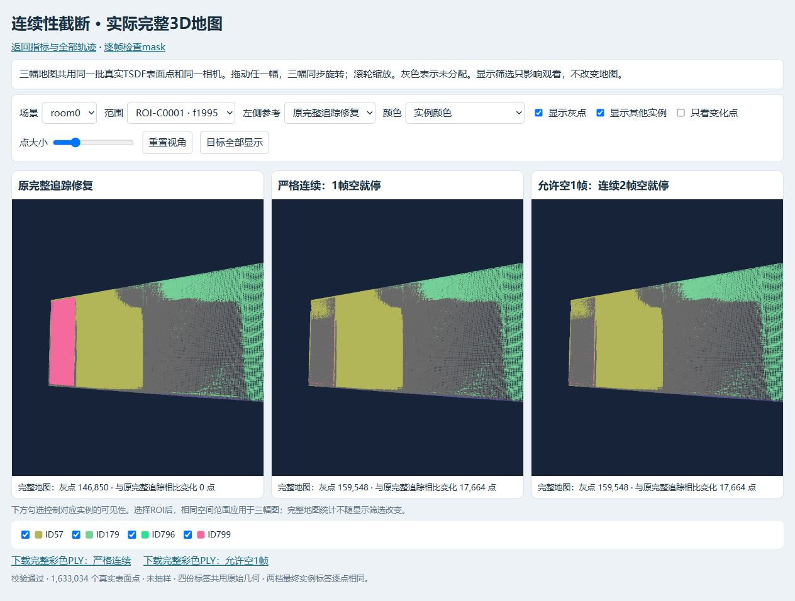
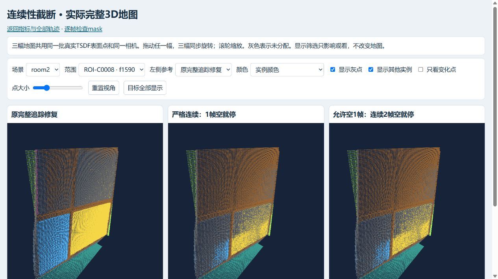

# room0 / room2 当前方法与效果归档（2026-10-09）

本分支从干净的 `SAM-track` (`cf3193ac6f56b30f2f47735470d327e593f3957b`) 建立。继承 room0、人选种子、联合撤票/换票、原生确认、扩散、范围约束和冻结 v3 实现；新增 room2 前30标注的实际运行快照、连续性截断对照及结果证据。原工作分支、原始地图和实验文件没有覆盖。

## 目录与方法

- `../room0_batch_repair_20261007/`：原 room0 联合修复代码；本次 `results_1009/` 补齐当时实际指标和冻结/验证记录。30原始轨迹，29规范身份，别名11→8。
- `../room2_top30_repair_20261008/`：前30中18条实际选择，14组有效种子/25原始轨迹，23规范身份；别名24→4、25→5。4处拒绝，12处未标注，不自动补选。原标注完整保留并校验SHA256。这是最新批次，区别于旧 `room2_batch_repair_20261007`。
- 本目录：`gap0` 原生mask第一次为空就停止；`gap1` 允许1帧为空，连续2帧为空停止。每个原始mask自人工种子分别向前、向后判断，停止后不自动恢复。基于2000原始帧，空为原生1200×680保存mask面积=0；没有新增小面积门槛。原400建图帧、身份、质量门槛、票权/去重、原生确认、扩散和局部提交规则保持。
- `../chronological_playback_20261008/`：两个场景的按帧播放导出/页面源代码及轻量记录。大体积无损RGB/mask帧包保留在 `/data`。

本轮是对已有SAM2.1实际输出施加精确前缀门控，再真实重算TSDF换票、确认与扩散。没有重跑SAM GPU传播或改变SAM内部记忆。`track_with_continuity.py` 是另附的后续流式候选实现，已做策略单元核验，尚未GPU运行验证，未替换生产追踪器。停止SAM轨迹不会自动撤掉停止帧中旧CropFormer观察，撤票仍服从既有规则。

## 实测结果

| 场景 | 条件 | AP50 (%) | F1 (%) | PQ (%) |
|---|---|---:|---:|---:|
| room0 | 原始P1-A1 | 26.2692 | 50.4348 | 37.1353 |
| room0 | 完整追踪修复 | 26.6393 | 51.2397 | 38.9129 |
| room0 | gap0 | 23.2953 | 47.9339 | 35.8368 |
| room0 | gap1 | 23.2953 | 47.9339 | 35.8368 |
| room2 | 原始P1-A1 | 28.4378 | 53.0120 | 34.8715 |
| room2 | 完整追踪修复 | 30.0330 | 54.7368 | 37.5218 |
| room2 | gap0 | 27.8465 | 52.6316 | 35.4579 |
| room2 | gap1 | 27.8465 | 52.6316 | 35.4579 |

统一v3代码、协议文件、GT版本及flags沿用原批次，当前为pending/debug、未冻结正式benchmark；这些是离线对照，不能当正式主表。GT只用于事后指标，不参与追踪、筛选、身份合并和修复。

未分配点：room0 原始145379、完整修复146850、两种截断159548；room2 原始150416、完整修复184351、两种截断181135。两个场景的 gap0/gap1 原生证据、票据与最终地图逐字节相同：room0 gap1额外74个mask×建图帧均被既有质量门槛拒绝；room2额外1个非空原生帧不在建图帧上。详见 `why_policies_equal.json` 和 `results/*/comparison_audit.json`。

硬截断删除了正确重现的物体证据，room0/room2的整体指标均低于完整修复；它也无法识别仍有非空mask的错误漂移。本次只保留为消融实验，没有提升为默认方法。后续建议是连续段+身份核验后另起种子，本分支没有擅自实施该建议。

## 已验证与修正

四次修复均通过完整400帧回放等于增量票据、准确回滚、未撤旧观察保持、范围外原始证据/票据/最终标签不变（最终范围外变化0）。原几何/RGB不变，预测在GT评估前冻结。原生无损mask验证4000帧/160帧包；PLY为全密度实例彩色文件，字段与原生float32坐标逐项相同，未降采样。本次归档前再次校验原始保护文件SHA。

初始导出器遇到恢复出的旧实例113缺失显式颜色、以及补充目标诊断不支持重复GT两处问题。保留原冻结脚本和失败历史；`continue_with_complete_palette.py` 用原 `audit_and_render.palette()` 的确定性颜色[249,74,245]补齐113，其他显式颜色不变。`evaluate_ablation_v2.py` 对每个目标单独调用原有诊断，保留重复GT的不同人工部件。两处仅修正导出/补充报告，没有改变核心v3或预测。完整记录在 `execution_record.json`、`evaluator_reporting_revision.json`、`local_validation/evaluator_reporting_diff.patch` 和结果收据中。

## 证据与复查

- `results/`：完整实际v3指标、冻结、回放/回滚/局部提交证明、最终PASS记录；历史失败也保留，最终状态以 `results/complete.json` 为准。
- `proofs/final_metrics_overview.png`、`proofs/final_3d_comparison.png`、`proofs/room2_local_3d_proof.png`、`proofs/final_mask_comparison.png`：真实网页指标、3D与mask截图，不是模拟。
- `artifact_manifest.json`：大体积PLY、全部点3D包、完整逐帧决定和冻结文件的服务器路径/大小/SHA256；原始PNG/NPZ/权重/帧包/日志不提交Git，详细输入哈希在原冻结索引中。
- `../publication_20261009/source_manifest.json`：本次复制的实际运行文件路径及逐文件SHA；原字节保持，没有把运行时绝对路径偷偷改成新分支目录。
- 本地实际页面：`http://127.0.0.1:8785/continuous_tracking_ablation_20261008/index.html`。仓库的 `local_review/` 是页面源代码，需配套实际结果JSON、二进制点包/原生帧包及已有Three.js vendor部署，不能把裸HTML当完整独立网站。

## 安全复现范围

本仓库按已有SAM-track规则保存实际运行快照，并非重新包装的通用安装程序。源脚本保留原服务器路径。已有完成输出不可覆盖；重做变体应新建 `/home/chenkejun/CVPR` 代码目录及 `/data/chenkejun/CVPR` 输出目录，记录新的freeze。`run_ablation.py`、`orchestrate_server.py`、`finish_server.py` 为初始/历史入口，初始补充报告限制已在新版评估器修正。`recover_pipeline.py` 含当时恢复进程检查；`local_tools/build_preview.py` 是初版预览构建器，会写预览页面，不能直接覆盖最终结果页。`publish_final_report.py` 是Windows本地报告构建工具，保留实际路径，不声称可直接Linux运行。

可独立执行无数据副作用的核验：在本目录运行 `python test_continuity_policy.py`（10项）；在最新room2目录运行 `python test_joint_batch_ops.py`（13项，需numpy）。GPU追踪候选尚未实跑，不能用这两组测试声称已验证GPU效果。

归档 `.gitattributes` 禁止冻结文件自动转换换行，并允许其原有尾部空白；保留原字节及SHA256，没有为通过Git检查重写源码。
