# 全部26个案例的固定种子视角

每幅图从左到右为：严格一票无修复、既有严格追踪修复、加核心区域历史重关联。点集和视角固定，灰色为未归属点；完整场景指标见[实验说明](README.md)。

## room0

### ROI-C0001 · f1995 · 目标ID 57, 179, 796, 799

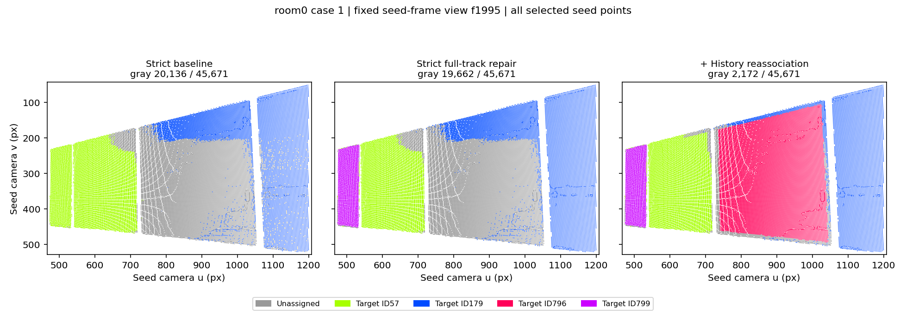

### ROI-C0002 · f190 · 目标ID 15

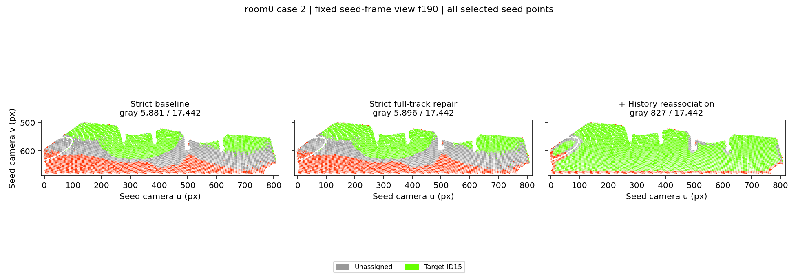

### ROI-C0005 · f580 · 目标ID 18, 19, 801, 804

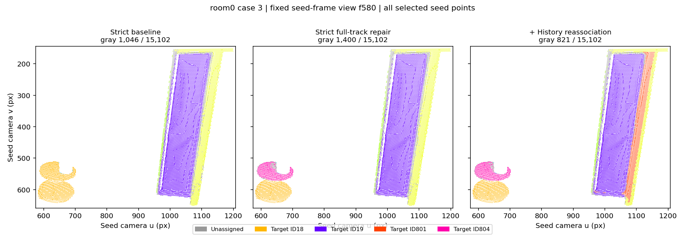

### ROI-C0007 · f1630 · 目标ID 216

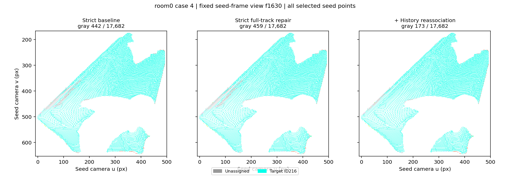

### ROI-C0010 · f1660 · 目标ID 18

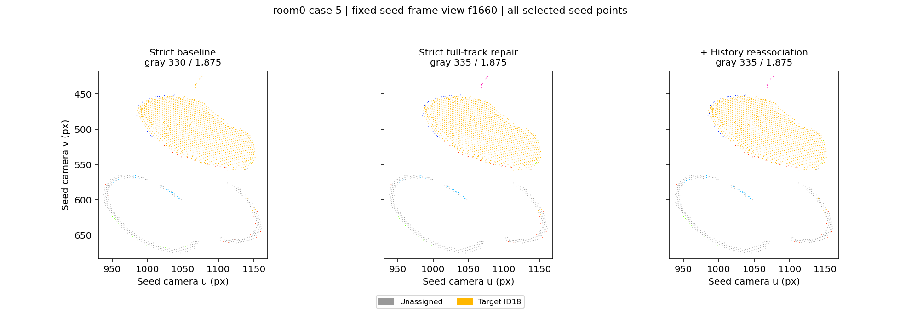

### ROI-C0011 · f1860 · 目标ID 174, 181, 809, 810

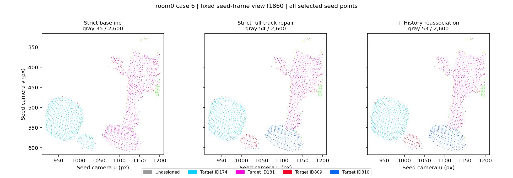

### ROI-C0015 · f0 · 目标ID 3, 16, 812

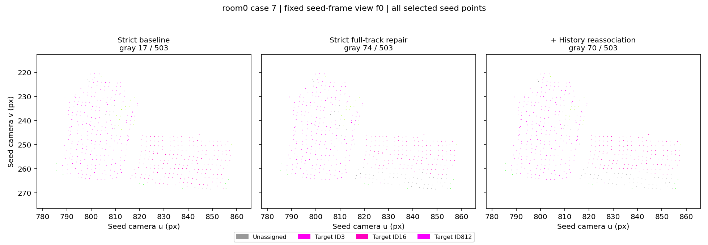

### ROI-C0020 · f1870 · 目标ID 218, 349, 815

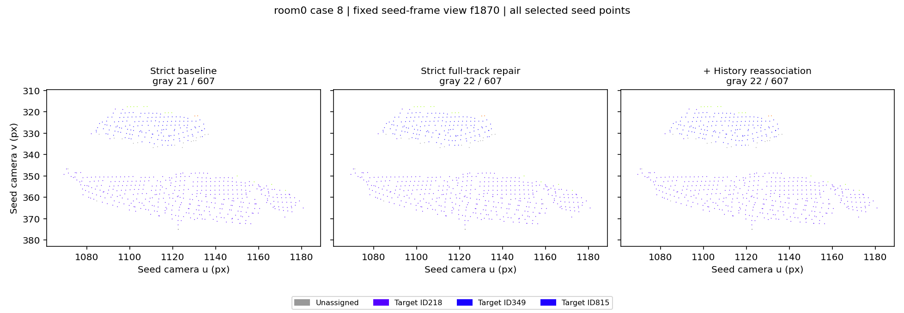

### ROI-C0021 · f945 · 目标ID 322, 818

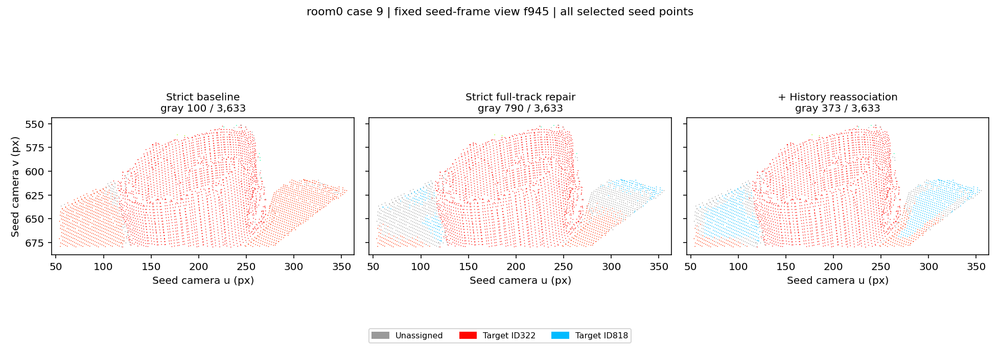

### ROI-C0030 · f1225 · 目标ID 227, 346, 348

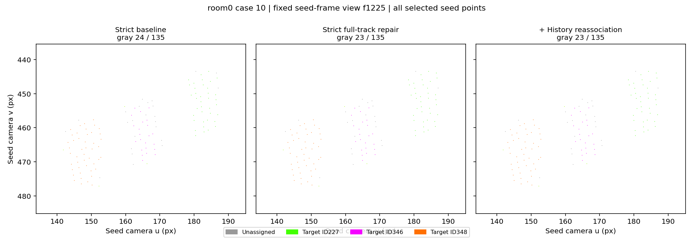

### ROI-U0002 · f785 · 目标ID 172, 185

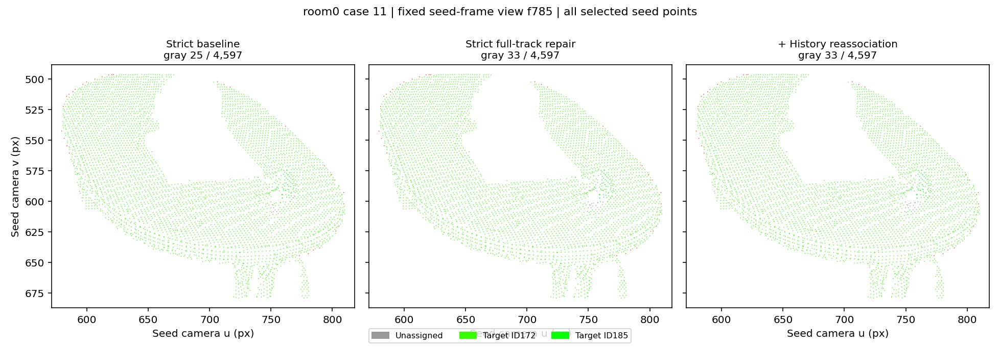

### ROI-U0017 · f1050 · 目标ID 13, 825

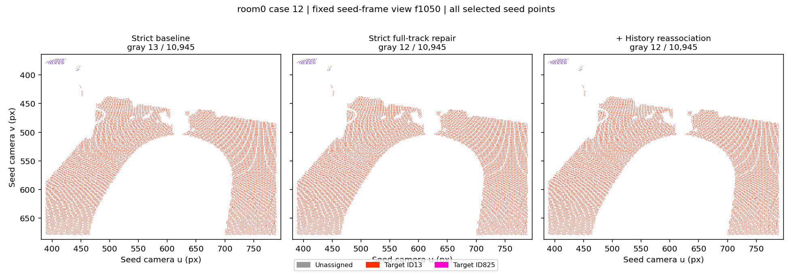

## room2

### ROI-C0001 · f735 · 目标ID 10, 350

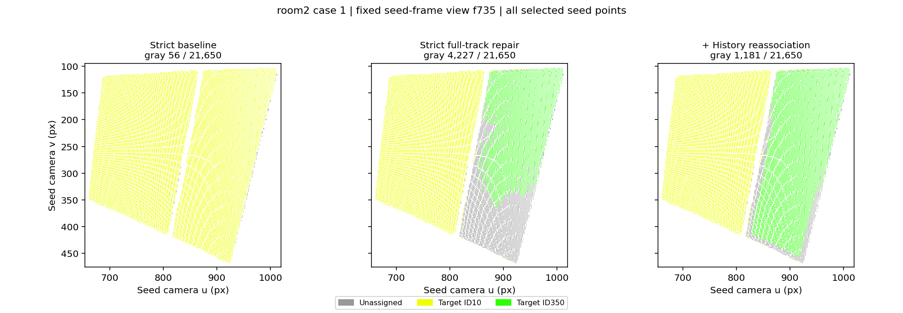

### ROI-C0002 · f1065 · 目标ID 44, 52, 352

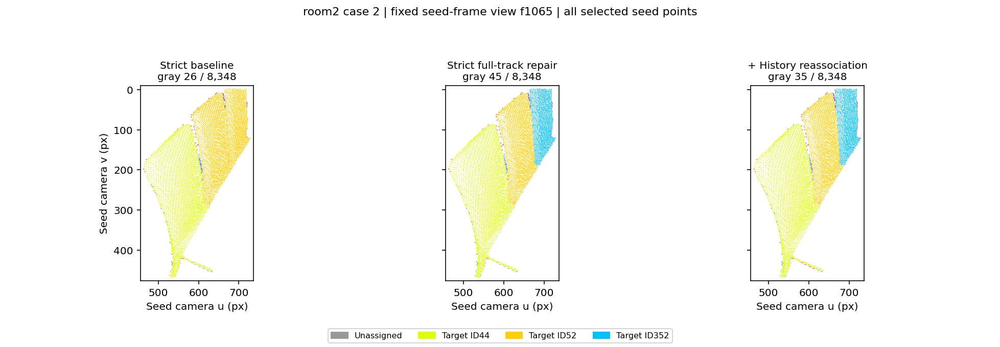

### ROI-C0003 · f1400 · 目标ID 254

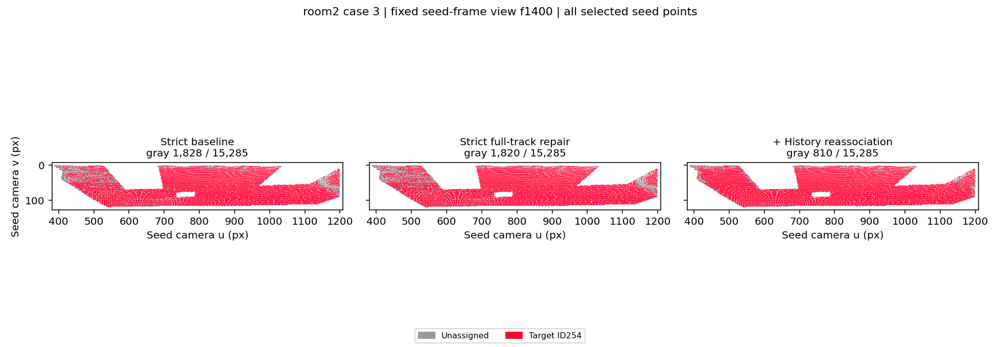

### ROI-C0005 · f1635 · 目标ID 355

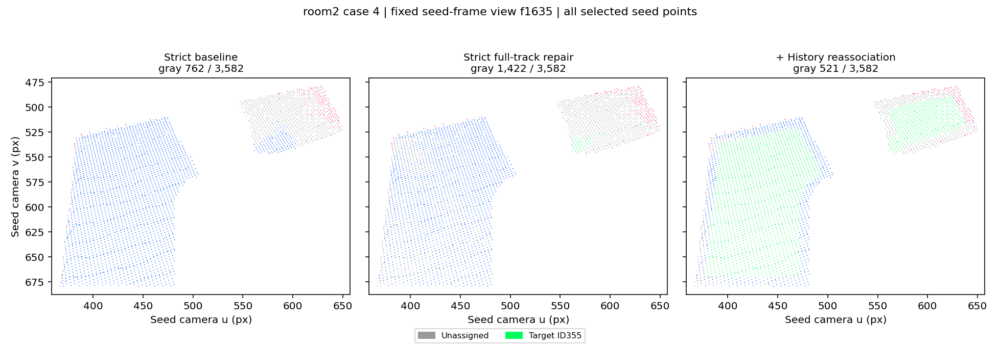

### ROI-C0007 · f1040 · 目标ID 356

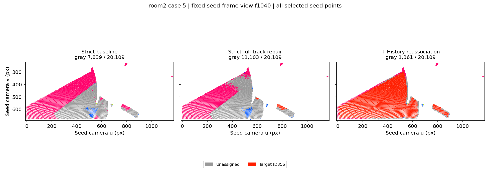

### ROI-C0008 · f1590 · 目标ID 357, 358, 359, 360

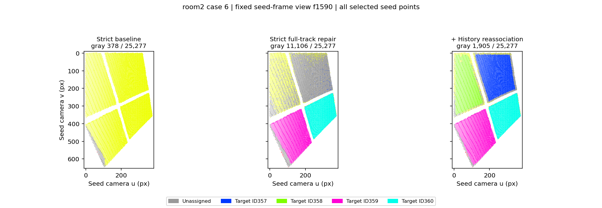

### ROI-C0009 · f1085 · 目标ID 361

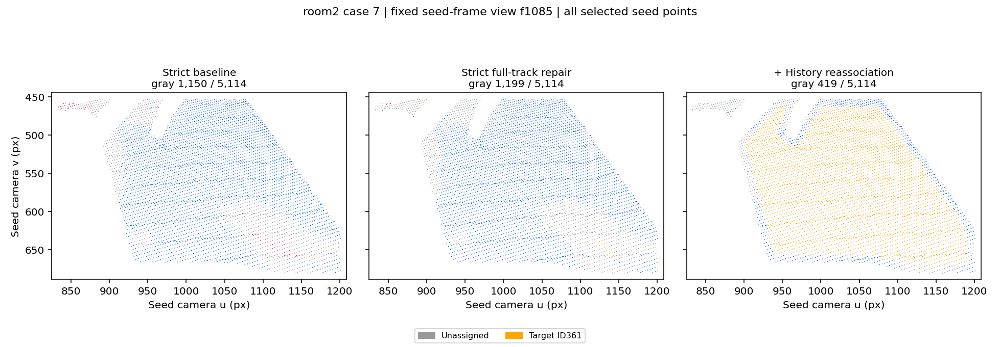

### ROI-C0011 · f1750 · 目标ID 362

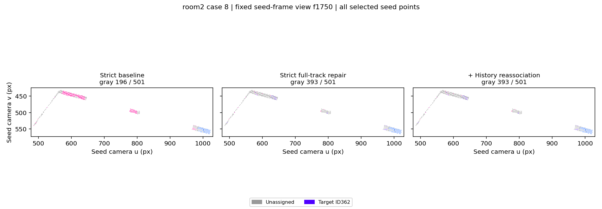

### ROI-C0012 · f1995 · 目标ID 8

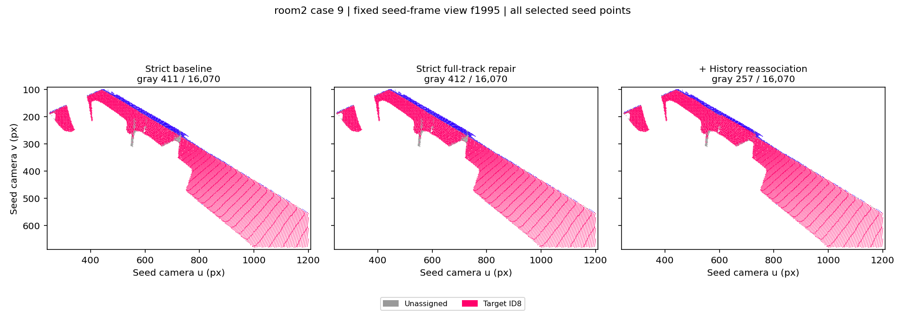

### ROI-C0013 · f795 · 目标ID 7, 18, 366

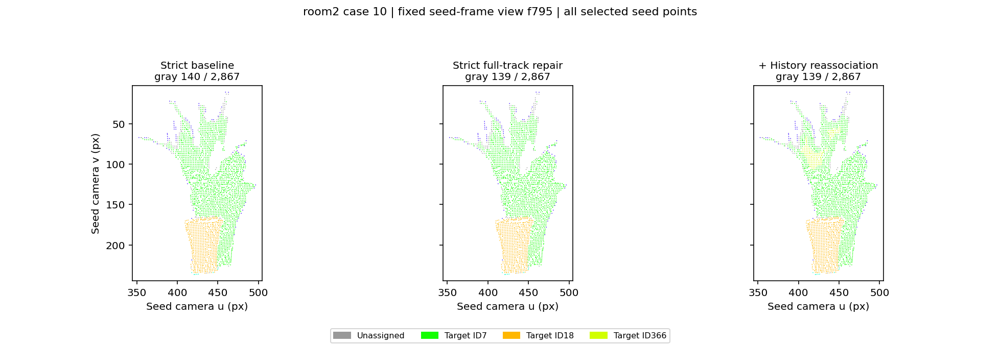

### ROI-C0015 · f455 · 目标ID 12, 22

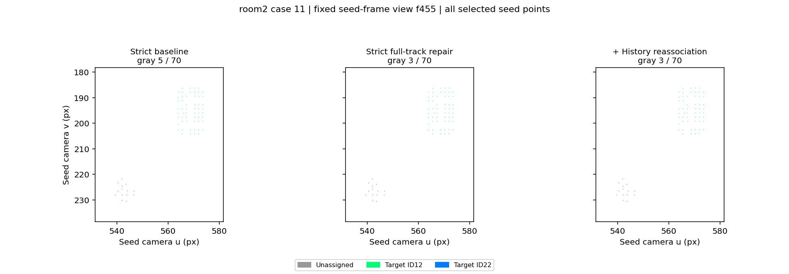

### ROI-C0016 · f940 · 目标ID 1

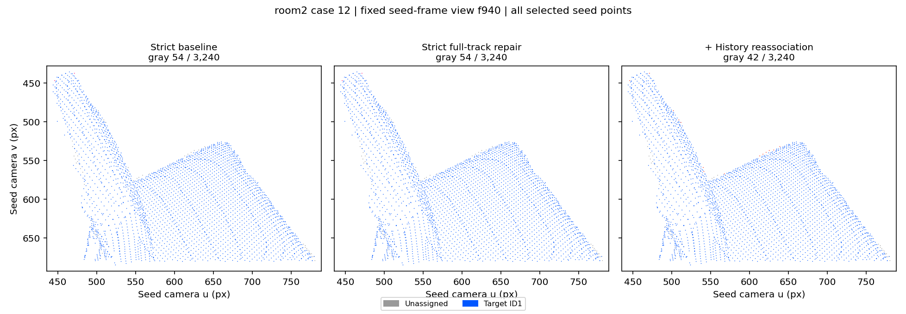

### ROI-C0025 · f1345 · 目标ID 211, 371

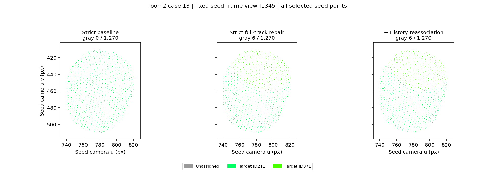

### ROI-C0029 · f1605 · 目标ID 52, 352

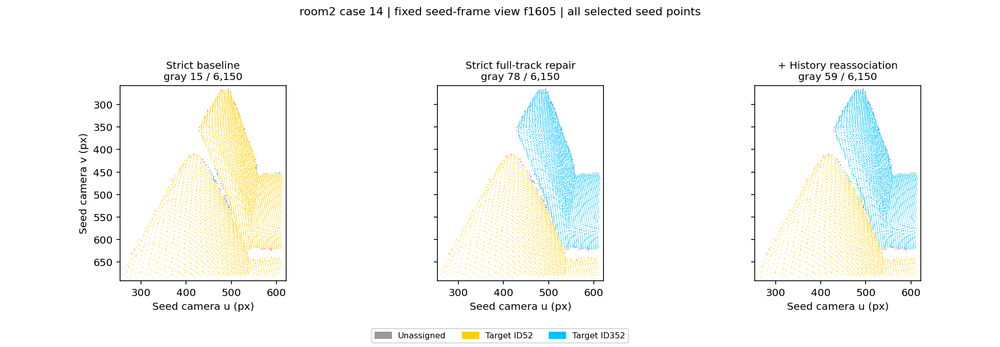
