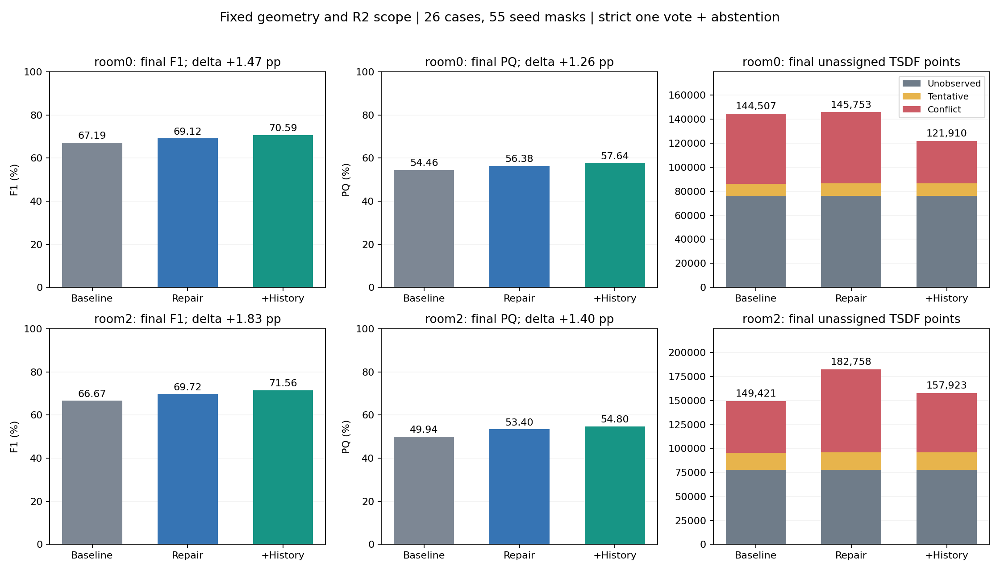
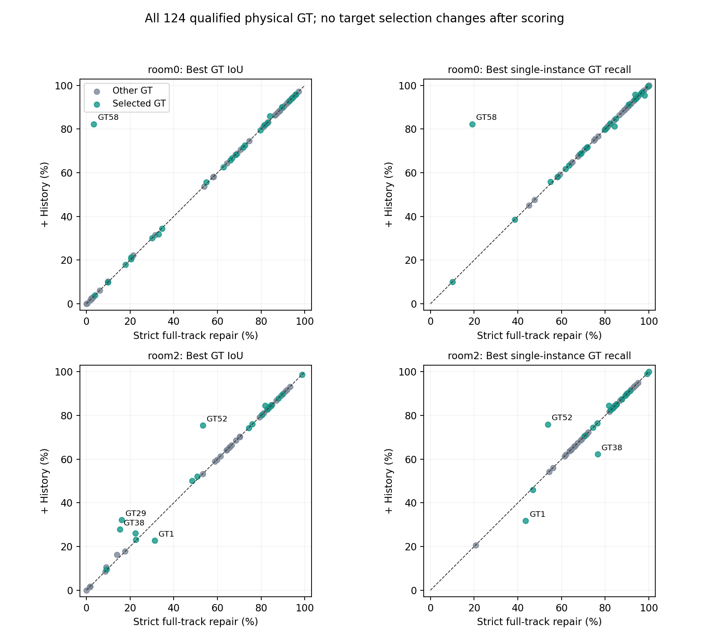

# P1-A1-strict-vote：核心区域历史重关联及两场景验证

2026-10-10 更新，归档 room0、room2 已完成的实验。固定人工种子核心内的历史观察重新关联后，两场景 F1、PQ 提高、冲突减少；同一物体被多个修复目标身份认领时仍会拆分，因此尚不替换冻结基线。

## 三个版本

1. **strict_baseline**：P1-A1 严格一帧一点最多一票，不同 ID 候选弃权；没有人工修复。完整生成代码和 R2 基线数据见[无修复基线归档](../p1a1_strict_vote_20261009/baseline_materialization/README.md)。
2. **strict_full_track**：在同一计票规则下运行既有人工种子＋SAM2 历史追踪修复。
3. **history_core**：在冻结的 strict_full_track 上，增加本目录的局部历史观察重关联。几何、原始关联、人工 Mask、追踪、确认阈值和后处理参数固定。

room0 使用12个案例、30个种子Mask；room2使用14个案例、25个种子Mask。共52个规范目标身份。运行400个建图帧/场景，复用既有2000帧追踪输出。

## 实现

- 每个人工种子Mask固定向内收缩10像素，再投影到固定TSDF点，形成目标核心。
- 同一持久目标身份的核心取并集；不同目标身份同时认领同一点，则标记歧义、保留当前观察。
- 检索所有仍保留的原始正ID观察，不再用 `old_family_ids` 作为身份边界。只有源深度像素投影到唯一核心，且旧ID不同，才修改该像素身份。
- 对原Mask做局部拆分，重新投影残留Mask和历史片段；已接受的新追踪Mask保持原样。整帧联合归约后，同ID共享支持计一票，多ID候选仍弃权。
- 使用归约前后有效票之差更新票表；原始观察不丢弃，已经撤销的观察不复活。最终后处理仅提交有效票变化范围。
- 空核心没有兜底或调参：room0有10/30、room2有3/25个空核心。两个场景均无不同目标核心的重叠点。

核心算子：[history_core_ops.py](code/history_core_ops.py)；实际回放：[run_history_core.py](code/run_history_core.py)；实际依赖快照：[dependencies](code/dependencies)。

## 最新 R2 最终结果

F1、PQ以百分比表示；灰点为最终仍未归属的全场景TSDF点，不是GT参考顶点数。

| 场景 | 条件 | F1 | PQ | 最佳单实例GT召回 | 最终灰点 |
|---|---|---:|---:|---:|---:|
| room0 | 严格一票无修复 | 67.19 | 54.46 | 82.91 | 144,507 |
| room0 | 既有追踪修复 | 69.12 | 56.38 | 81.22 | 145,753 |
| room0 | 加历史重关联 | **70.59** | **57.64** | 82.07 | **121,910** |
| room2 | 严格一票无修复 | 66.67 | 49.94 | 79.59 | 149,421 |
| room2 | 既有追踪修复 | 69.72 | 53.40 | 76.40 | 182,758 |
| room2 | 加历史重关联 | **71.56** | **54.80** | 76.37 | **157,923** |
| 两场景合并 | 严格一票无修复 | 66.96 | 52.52 | 81.52 | 293,928 |
| 两场景合并 | 既有追踪修复 | 69.39 | 55.05 | 79.20 | 328,511 |
| 两场景合并 | 加历史重关联 | **71.02** | **56.37** | 79.68 | **279,833** |

相对既有追踪修复，合并F1 +1.63、PQ +1.32个百分点，灰点减少48,678（14.82%）。最终三状态：U 154,194→154,194；T 28,267→28,265；C 146,050→97,374。各场景详细状态和原生结果见[完整对比JSON](results/evaluation_r2/comparison.json)。



## 目标完整度与退化

45个选中物理GT的平均best-IoU 58.38%→61.37%，16个提高、5个下降、24个不变；79个其他GT的最佳单实例召回全部不变。固定参考表面正确归属净增15,992，但错误归属也净增7,460，不能仅凭消灰点判定所有修改正确。

- **room0 GT58百叶窗**：IoU 3.44%→82.32%，复现此前诊断案例。排除这个已诊断物体，其他44个目标平均IoU +1.26个百分点，平均最佳召回 −0.082个百分点。
- **room0 GT60地毯**：同一物体被13、15两个目标ID认领；IoU 33.09%→31.95%，召回84.20%→81.26%。
- **room2 GT1地毯**：355、356、361三个目标核心都属于同一物理GT，原ID1仍保留其他部分；IoU 31.25%→22.80%，召回43.61%→31.81%。需先解决修复目标身份一致性。
- **room0 GT36门**：目标801的核心混合了GT36和GT61，333个门参考顶点从10改为801，门召回98.03%→95.45%。向内收缩不能保证Mask身份正确。
- **room2 GT38百叶窗**：最佳单实例召回76.60%→62.25%，同时IoU 15.28%→27.80%、正确归属增加1,602。旧大合并ID10属于其他GT32，部分被正确分给358；最大召回下降在此不能单独解释为错误修复。

room2的正确归属净增6,155，由实际改标签处+8,599与标签未变处匹配变化−2,444组成。跨方法匹配变化应按持久ID解释；[剩余案例诊断](results/evaluation_r2/analysis/remaining_case_diagnosis.json)提供了归一到持久ID的匹配变更，避免把方法不同导致的 `instance_uid` 前缀变化误认作物理身份修改。



## 正确性与评价协议

- 8项算子测试含100轮独立随机字典对照；两场景各400帧的全量票据重算与增量一致，可精确回滚。
- 原始、保留与既有新Mask重投影和冻结支持一致；源像素账目与新片段投影一致；同ID共享支持保留；范围外票据、证据和最终标签逐项不变。
- room0原单案例85帧事务精确复现；本次383/394帧发生历史源像素重关联，总计4,388,606个采样像素。
- 两场景预测一起冻结后再进行新评分，未按GT选择源像素、帧、目标ID或阈值。此前已检查过GT58，属于**诊断驱动的开发实验**，不是预注册泛化基准。
- 从 main 工作区 `/home/chenkejun/CVPR/worktrees/v3-r2-main-20261009` 运行当前默认 `python -m unified_eval.cli`。固定 `object_observed_repair / revision 2`，评分源码 `cd260569e89de1e9525f82c45ee10842b80616b0`，审核归档 `d035f68770cefab27c9751e97062c72faa07367c`。
- 固定350个可评价GT，此处评价room0的72个与room2的52个；6个极小待审GT和168个UNKNOWN保持原样。配置 `frozen=false`。所有条件共用相同几何、GT范围与对应缓存，冻结控制分数精确复现。

第一次回放在无有效追踪提议帧停止，随后按原程序保留原帧的语义修正；首次评分前的数量断言改为按 `gt_scope` 核对可评价集合。失败尝试与原代码保存在 [attempts](results/attempts)，未混入正式结果。

## 文件与复验

- [完整中文HTML报告，含26个案例图](results/two_scene_report_zh.html)（下载后浏览器打开）；[全部案例图索引](CASE_INDEX.md)。
- [三条件最终CSV](results/two_scene_comparison.csv)、[原生与最终完整CSV](results/evaluation_r2/comparison.csv)、[124个物体变化CSV](results/evaluation_r2/per_gt_vs_current_repair.csv)。
- [预测冻结](results/predictions_freeze.json)、[评分完成与哈希](results/evaluation_r2/evaluation_complete.json)、[逐文件归档来源](publication_provenance.json)。
- [原始代码与证据包](results/two_scene_history_reassociation_audit.zip)，包含选中表面的NPZ；完整地图及逐帧事务保留在服务器。
- [PLY清单与SHA256](exports/pointcloud_manifest.json)：严格基线完整实例/仅三状态及重关联完整实例，共6个PLY。配色统一，保留实例ID、原生状态与表面索引。大文件不重复存入Git历史。

无需数据的算子验证：

```bash
python -m unittest discover -s experiments/sam_track/p1a1_history_core_reassociation_20261009/code -p 'test_history_core.py' -v
python -m unittest discover -s experiments/sam_track/p1a1_strict_vote_20261009/tests -p 'test_strict_vote.py' -v
python experiments/sam_track/p1a1_history_core_reassociation_20261009/verify_publication.py
```

完整回放顺序：`run_history_core.py` → `evaluate_history_core_r2.py` → `analyze_remaining_cases.py` → `build_two_scene_report.py`。`code/` 是实际运行快照，依赖原始冻结几何、Mask、关联与追踪数据；完整重算时选择新的实验/输出目录并更新固定路径，不能覆盖既有冻结结果。评价始终使用上述main工作区的当前默认R2入口。

代码目录：`/home/chenkejun/CVPR/experiments/p1a1_history_core_reassociation_20261009`；数据目录：`/data/chenkejun/CVPR/results/p1a1_history_core_reassociation_20261009`。冻结P1-A1与当前评分器源码均未修改。
